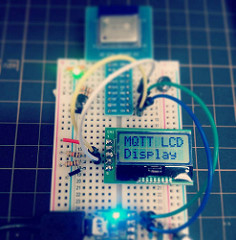

mqtt_lcd_display_test
====

mqtt_lcd_display_pub.rb
----

setup

    $ sudo gem install mqtt
    $ sudo gem install pit

    $ cd ~/work/
    $ git https://github.com/yoggy/mqtt_lcd_display_test.git
    $ cd mqtt_lcd_display_test
    $ EDITOR=vim ruby mqtt_lcd_clock_pub.rb
        ---
        remote_host: mqtt.example.com
        remote_port: 1883
        use_auth: false
        username: username
        password: password
        topic: publish_topic

    connected!
        .
        .
        .
    ~C

    $ sudo cp mqtt_lcd_clock_pub.conf.sample /etc/supervisor/conf.d/mqtt_lcd_clock_pub.conf
    $ sudo vi /etc/supervisor/conf.d/mqtt_lcd_clock_pub.conf
        (fix path, etc...)
    $ sudo supervisorctl reread
    $ sudo supervisorctl add mqtt_lcd_clock_pub
    $ sudo supervisorctl status
    mqtt_lcd_clock_pub                  RUNNING    pid 8192, uptime 0:00:30

Copyright and license
----

Copyright (c) 2015 yoggy

Released under the [MIT license](LICENSE.txt)

